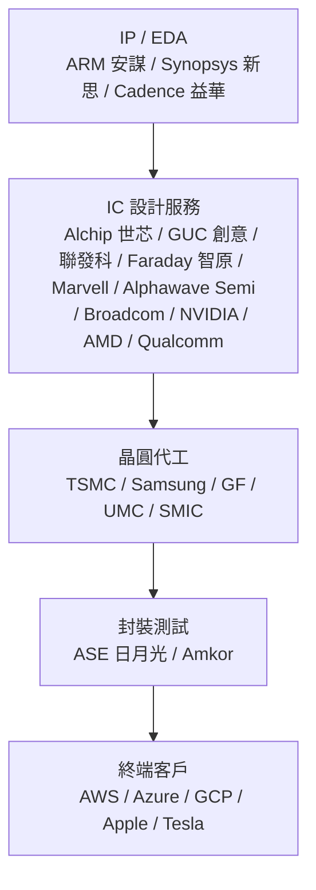

# 台灣 ASIC/IC 設計服務 · 財務比較

三家具代表性的台灣 ASIC / IC 設計公司 — 世芯-KY、創意電子、聯發科 — 的季度財務數據一頁式儀表板，快速掌握營運趨勢。

## 網址

https://asic-compare.vercel.app

## 產業生態系總覽

## 為什麼這個專案有用？

- **一站式追蹤**：不用分別去公開資訊觀測站撈三家的季報，營收、毛利率、EPS 整理在同一頁
- **法說會紀要整合**：每季法說會重點直接寫在旁邊，不用再翻新聞稿
- **開源透明**：資料來源全標示公開資訊觀測站，數字可追溯、可驗證
- **自動化更新腳本**：內建批次更新按鈕，新季度資料可直接補充

## 資料來源

公開資訊觀測站 (mops.twse.com.tw)

