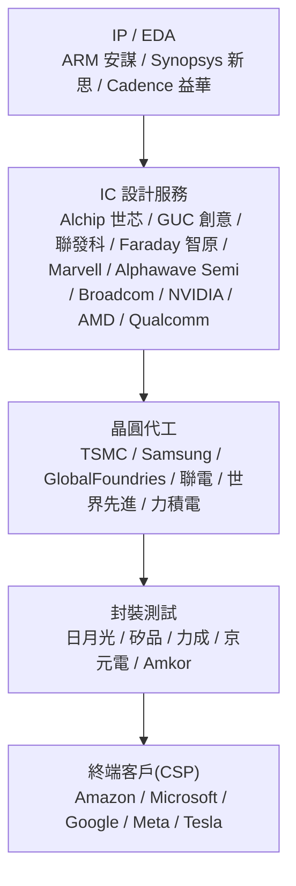

# 台灣 ASIC/IC 設計服務 · 財務比較

三家具代表性的台灣 ASIC / IC 設計公司 — 世芯-KY、創意電子、聯發科 — 的季度財務數據一頁式儀表板，快速掌握營運趨勢。資料來源:公開資訊觀測站 (mops.twse.com.tw)

## 網址

https://asic-compare.vercel.app


## 產業生態系總覽

```mermaid
flowchart TD
    A["IP / EDA
    ARM 安謀 / Synopsys 新思 / Cadence 益華"]
    B["IC 設計服務
    Alchip 世芯 / GUC 創意 / 聯發科 / Faraday 智原 / Marvell / Alphawave Semi
    / Broadcom / NVIDIA / AMD / Qualcomm"]
    C["晶圓代工
    TSMC / Samsung / GlobalFoundries / 聯電 / 世界先進 / 力積電"]
    D["封裝測試
    日月光 / 矽品 / 力成 / 京元電 / Amkor"]
    E["終端客戶(CSP)
    Amazon / Microsoft / Google / Meta / Tesla"]

    A --> B --> C --> D --> E
```

## IC 設計公司成本結構筆記：NRE → Turnkey 量產

整理 Fabless IC 設計公司從研發到量產的完整成本項目，依製程順序排列，並附上目前對應的主要廠商，供 Supply Chain / Financial Analyst 面試與學習參考。

> 本筆記聚焦 Fabless（無晶圓廠）IC 設計公司視角，不含晶圓代工廠或封測廠自身的內部成本結構。

> **傳統 SoC vs AI ASIC**：以下第一、二節列出的是「傳統消費性 IC」（如手機 SoC）的通用成本架構。AI ASIC（如雲端 AI 加速器、CSP 客製化晶片）因製程更先進、晶片更大、且涉及 HBM 等稀缺物料，會有額外的成本項目與財務操作，整理在 [第六節](#六ai-asic-的額外成本與財務考量) 單獨說明，兩者不能直接套用同一套邏輯。

---

### 目錄

- [成本架構總覽](#成本架構總覽)
- [一、NRE 成本（一次性研發成本）](#一nre-成本一次性研發成本)
- [二、Turnkey 量產成本（隨出貨量變動）](#二turnkey-量產成本隨出貨量變動)
- [三、成本計算邏輯](#三成本計算邏輯)
- [四、供應鏈流程圖](#四供應鏈流程圖)
- [五、主要廠商對照表](#五主要廠商對照表)
- [六、AI ASIC 的額外成本與財務考量](#六ai-asic-的額外成本與財務考量)

---

### 成本架構總覽

| | NRE 成本 | Turnkey / Recurring 成本 |
|---|---|---|
| 計價方式 | 一次性 | 按顆 / 按批次 |
| 跟出貨量的關係 | 無關，固定投入 | 出貨量越大，單顆分攤的 NRE 越低 |
| 財務處理 | 通常資本化或分期攤銷 | 直接計入 COGS（銷貨成本） |
| 分析重點 | 攤提到多少顆產品、多久攤完 | 良率、代工報價、封測報價變化 |

---

### 一、NRE 成本（一次性研發成本）— 傳統 SoC 架構

NRE（Non-Recurring Engineering）是指「讓這顆晶片可以量產」之前必須投入的固定成本，與最終出貨量無關。以下為手機 SoC 等傳統消費性 IC 的通用項目；AI ASIC 的額外項目請見第六節。

| 項目 | 說明 | 主要對應廠商類型 |
|---|---|---|
| 架構設計（Architecture Design） | 定義晶片規格、功能區塊分配，以工程師人力成本為主 | 公司內部研發團隊 |
| IP 整合（IP Licensing & Integration） | 購買 / 授權第三方 IP（如 CPU 核心、記憶體控制器），一次性授權費 + 可能有 per-unit royalty | ARM、Synopsys、Cadence、Arteris |
| EDA 工具授權費 | 設計軟體授權費，通常按年租用 | Synopsys、Cadence、Siemens EDA（Mentor Graphics） |
| 電路設計 / 邏輯設計（RTL Design） | 工程師人力成本 | 公司內部研發團隊 |
| 電路佈局（Layout / Physical Design） | 把邏輯電路轉成實際晶片上的物理佈局 | 公司內部 or 委外設計服務（Design House，如創意電子 GUC、世芯 Alchip） |
| 驗證（Verification） | 確保設計正確性，含模擬測試平台 | Synopsys、Cadence、Siemens EDA |
| 光罩費用（Mask / Photomask Cost） | 設計定案後製作光罩，**NRE 中最貴的單項**，先進製程一套可達千萬美金等級 | 台積電（TSMC）、Photronics、Toppan |
| 首次流片（Tape-out / Engineering Run） | 送第一批試產晶圓驗證設計，含少量 wafer 成本 | 台積電（TSMC）、聯電（UMC）、三星（Samsung Foundry） |
| 測試程式開發（Test Program Development） | 開發 CP Test / Final Test 用的測試程式，含 ATE 設備租用時間 | 愛德萬測試（Advantest）、泰瑞達（Teradyne） |
| 封裝設計（Package Design） | 設計封裝形式（BGA、QFN 等），新封裝型態需額外開發成本 | 日月光（ASE）、矽品（已併入 ASE）、艾克爾（Amkor） |

---

### 二、Turnkey 量產成本（隨出貨量變動）— 傳統 SoC 架構

量產後，每多出貨一顆就會實際發生的成本項目。此為傳統消費性 IC 的通用項目；AI ASIC 因用到 HBM、ABF 載板等稀缺物料，成本結構與採購方式明顯不同，見第六節。

| 項目 | 說明 | 主要對應廠商 |
|---|---|---|
| Wafer Cost | 跟晶圓代工廠買 wafer 的費用，依製程節點（如 3nm / 7nm / 28nm）報價不同 | 台積電（TSMC）、三星（Samsung Foundry）、聯電（UMC）、格芯（GlobalFoundries） |
| Die Yield Loss（良率損耗） | 非直接付費項目，但決定每片 wafer 能分攤到多少 good die，間接推高單位成本 | — |
| CP Test（晶圓測試 / Wafer Sort） | 切割前逐顆測試電性，需用探針卡（Probe Card） | 台積電（自行測試或委外）、京元電子、旺矽科技（探針卡）、中華精測（探針卡） |
| Assembly / Packaging Cost（封裝成本） | 依封裝型態（QFN、BGA、Flip Chip 等）計價，通常按顆 | 日月光（ASE）、艾克爾（Amkor）、江蘇長電（JCET） |
| Final Test Cost（最終測試成本） | 依測試時間（秒數）計價，測試越複雜/越久成本越高 | 日月光（ASE）、京元電子、力成科技 |
| Substrate Cost（封裝基板成本） | 先進封裝（如 Flip Chip）所需的封裝基板材料 | 欣興電子、南亞電路板、Ibiden、Kinsus |
| Burn-in Test（老化測試，視規格需求） | 部分規格要求的額外可靠度測試 | 京元電子、日月光（ASE） |
| 物流 / 報關成本 | wafer、die 在不同廠商間運送的物流費用 | 第三方物流商 |
| IP Royalty（單顆版稅） | 部分 IP 授權採「每賣一顆付一次錢」而非一次性買斷 | ARM 及其他 IP 供應商 |

---

### 三、成本計算邏輯

#### 單顆晶片總成本（簡化公式）

```
單顆總成本 = (NRE ÷ 預估總出貨量) + (Wafer Cost ÷ 每片 wafer 之 good die 數) + Assembly Cost + Test Cost
```

#### Good Die 計算

```
每片 wafer 之 good die 數 = 每片 wafer 可切割總 die 數 × 良率（Yield %）
```

**關鍵重點**：wafer 一旦下單，成本即為沉沒成本（固定支出）；良率越低，能分攤成本的 good die 越少，單顆成本就越高。良率是供應鏈成本分析中影響毛利率最關鍵的變數。

#### 規模效應

出貨量越大，NRE 分攤到每顆產品的金額越低 → 這是為何量產規模對 IC 設計公司毛利率影響巨大的原因。

---

### 四、供應鏈流程圖

```
IC 設計公司（Fabless）
    │  架構設計、IP整合、電路設計、佈局、驗證
    ▼
晶圓代工廠（Foundry）— 台積電 / 聯電 / 三星
    │  光罩製作 → 晶圓製程（微影/蝕刻/沉積）
    │  CP 測試（Wafer Sort，使用探針卡）
    │  切割成 die
    ▼
封裝測試廠（OSAT）— 日月光 / 艾克爾 / 京元電子 / 力成
    │  封裝（Assembly/Packaging）
    │  最終測試（Final Test）+ Binning 分級
    ▼
成品 IC 交付 IC 設計公司
    ▼
下游客戶（品牌商）採購 IC，焊接於 PCB 板上（PCB 由 CCL 製成）
    ▼
終端產品（手機、電腦、伺服器等）
```

---

### 五、主要廠商對照表

| 供應鏈階段 | 代表廠商（依規模/常見度排序） |
|---|---|
| IC 設計（Fabless） | 聯發科（MediaTek）、瑞昱（Realtek）、聯詠（Novatek）、NVIDIA、AMD、高通（Qualcomm） |
| Design House（委外設計服務） | 創意電子（GUC）、世芯電子（Alchip）、智原科技（Faraday） |
| EDA 工具 | Synopsys、Cadence、Siemens EDA（原 Mentor Graphics） |
| IP 供應商 | ARM、Synopsys（DesignWare）、Arteris |
| 晶圓代工（Foundry） | 台積電（TSMC）、三星（Samsung Foundry）、聯電（UMC）、格芯（GlobalFoundries）、中芯國際（SMIC） |
| 探針卡 | 旺矽科技、中華精測、Technoprobe |
| ATE 測試設備 | 愛德萬測試（Advantest）、泰瑞達（Teradyne） |
| 封裝測試（OSAT） | 日月光投控（ASE Technology）、艾克爾（Amkor）、京元電子、力成科技、江蘇長電（JCET） |
| 封裝基板 | 欣興電子（Unimicron）、南亞電路板、景碩科技、Ibiden、Kinsus |
| PCB | 欣興電子、南亞電路板、臻鼎-KY（Zhen Ding） |
| CCL（銅箔基板） | 台光電子、聯茂電子、Panasonic |
| HBM（AI ASIC 專用） | SK 海力士（SK Hynix）、三星（Samsung）、美光（Micron） |
| 先進封裝（CoWoS 等，AI ASIC 專用） | 台積電（TSMC） |

---

### 六、AI ASIC 的額外成本與財務考量

雲端 AI 加速器 / CSP 客製化 ASIC（例如替 Google 做 TPU 相關晶片）跟傳統手機 SoC 相比，晶片更大、I/O 更多、功耗更高，因此在成本結構與供應鏈財務操作上多出幾個關鍵差異點。

#### 6.1 額外/加重的成本項目

| 項目 | 說明 | 與傳統 SoC 的差異 |
|---|---|---|
| HBM（高頻寬記憶體） | AI 運算需要極高記憶體頻寬，HBM 是外購關鍵物料，非公司自行設計生產 | 傳統 SoC 較少用到，且 HBM 全球產能長期供不應求，議價力在供應商手上 |
| ABF 載板（Ajinomoto Build-up Film substrate） | 用於高階、高腳位數的先進封裝（如 Flip Chip、CoWoS），是第二節「Substrate Cost」項目底下更具體、更高階的品項 | 傳統 SoC 通常用一般封裝基板即可，成本與供給穩定度遠不如 ABF 載板緊張 |
| 先進封裝費用（CoWoS 等） | AI 晶片常需 chiplet、2.5D/3D 封裝，委由台積電先進封裝產能處理 | 傳統 SoC 多用標準封裝（QFN、BGA），成本與產能取得難度低很多 |
| 先進製程 Wafer Cost | AI ASIC 多採用最先進製程節點（如 3nm 以下） | 單價遠高於手機 SoC 常用的成熟或次先進製程 |

#### 6.2 額外的供應鏈財務操作

因為 HBM、ABF 載板、先進封裝產能與先進製程晶圓產能目前都處於**供給緊缺**狀態，IC 設計公司為確保未來出貨能力，會採取傳統 SoC 較少見的財務手段：

- **提前採購 / 鎖定產能（Capacity Reservation）**：不是「下單就有貨」，而是要提前向供應商預付款項或簽長約，換取供應優先順位
- **預付晶圓代工產能費用（Foundry Capacity Prepayment）**：先付錢卡先進製程產能，避免未來產能被競爭對手搶走
- **資本市場募資支應供應鏈支出**：例如發行可轉換公司債（Convertible Bond），將部分資金用於提前採購 HBM、ABF 載板或預付代工產能費用，而非僅用於傳統研發或資本支出
- **客戶策略性入股 / 認購（Strategic Investment）**：部分大型雲端服務商（CSP）客戶可能參與 IC 設計公司的募資工具（如認購可轉債），代表雙方合作關係的進一步鞏固，也讓客戶在物料供給緊張時獲得一定程度的保障

#### 6.3 對財務分析的意義

這代表 Supply Chain Financial Analyst 在 AI 相關產品線上，工作範疇會超出傳統的 BOM 成本分析，延伸到：

- 評估「提前採購」在財務報表上的影響（例如預付款項、存貨提前認列）
- 分析資本市場募資工具（可轉債等）與供應鏈支出之間的資金配置邏輯
- 追蹤 HBM、ABF 載板等關鍵物料的供給狀況對未來營收認列與毛利率的潛在影響

> 範例參考：2026 年市場分析指出，聯發科發行可轉債募集資金可能用於提前採購 HBM、ABF 載板及預付晶圓代工產能費用，以確保未來 AI ASIC 產品供應能力；同一輪募資中據報有雲端服務商參與認購，反映雙方在 AI 晶片合作關係上的進一步綁定。這類案例是「供應鏈成本管理」與「資本配置策略」交集的具體例子。

---

